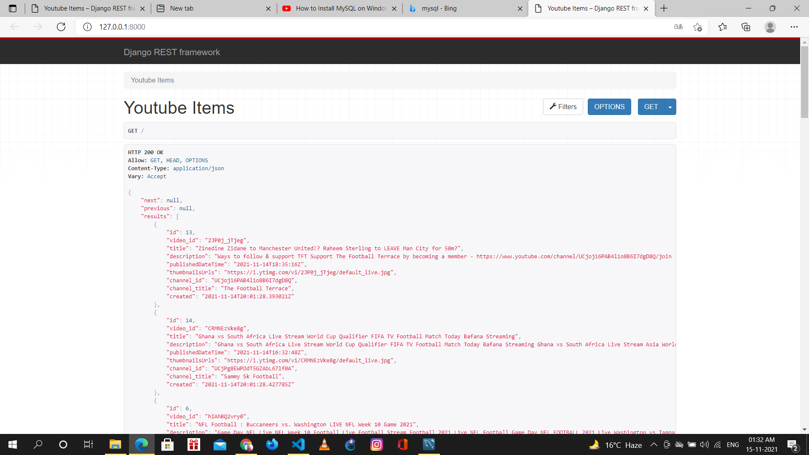
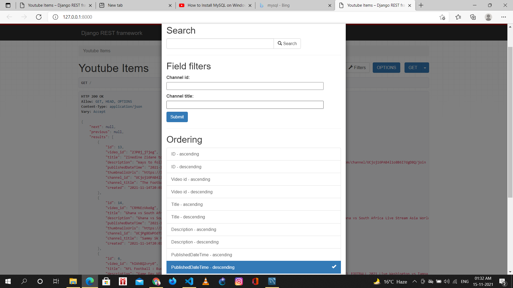

# Youtube_fetch_api
To make an API to fetch latest videos sorted in reverse chronological order of their publishing date-time from YouTube for a given tag/search query in a paginated response.
# Basic Requirements:
- Server should call the YouTube API continuously in background (async) with some interval (say 10 seconds) for fetching the latest videos for a predefined search query and should store the data of videos (specifically these fields - Video title, description, publishing datetime, thumbnails URLs and any other fields you require) in a database with proper indexes.
- A GET API which returns the stored video data in a paginated response sorted in descending order of published datetime.
- A basic search API to search the stored videos using their title and description.
# How server is calling the Youtube API continuously in background?
We have used django_cron to fetch videos after every 10 seconds using [Youtube Data API](https://developers.google.com/youtube/v3/docs/search/list) and save it to the MySQL database.
# Setup in local
- Clone the project
- As this project is based on Django, your system need to have proper python setup ,refer [this](https://www.python.org/downloads/)
- Go the project through the terminal and install all dependencies by using typing pip install -r requirements.txt in the terminal
- Inside the setting.py file, fill the variable GOOGLE_API_KEYS with all the API Keys available,the list should be filled as ['API_KEY_1','API_KEY_2',...]
- For getting an API key follow [this](https://developers.google.com/youtube/v3/getting-started)
- Setup crontab to run Job, follow [this](https://django-cron.readthedocs.io/en/latest/installation.html)
- Run the server using python mange.py runserver
# Set up MySQL
- Open MySQL Workbench
- Click the Schema tab
- Right-click in the Schema list and select Create Schema
- Give it a name and follow the prompts to create it
# Screenshots

### Get API

### Search API

